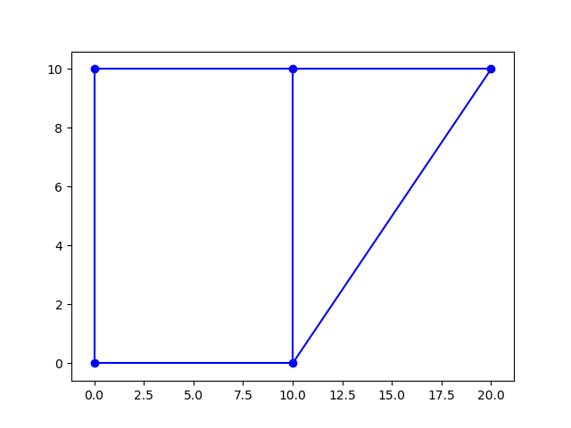
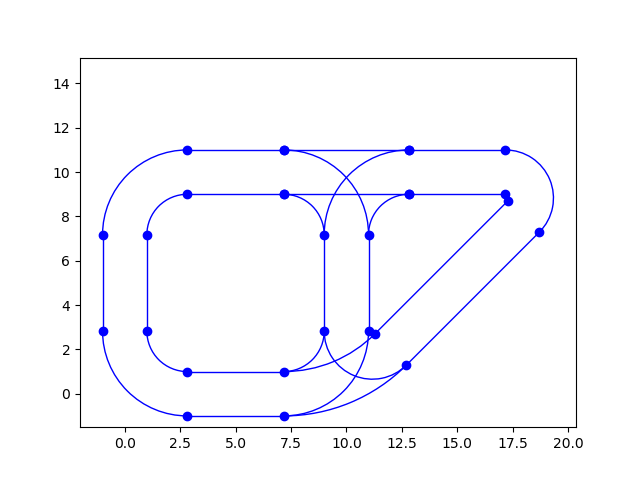
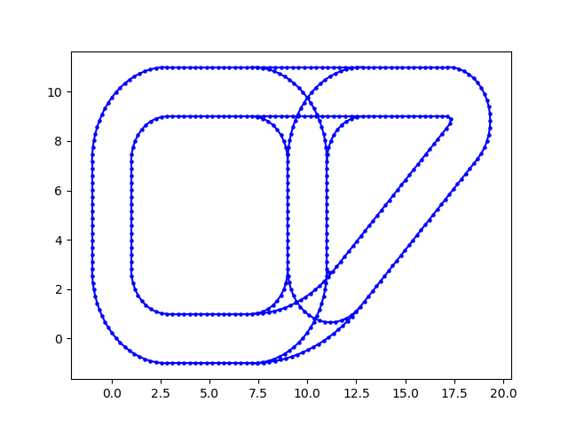
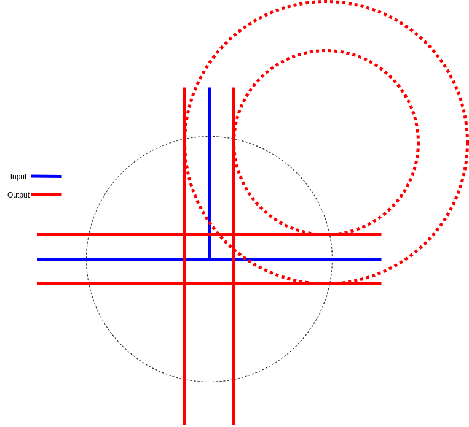

# OSM CONVERTER

## Dependencies
python 3.6.8 
numpy 1.17.5 
matplotlib 3.1.3
geopy 2.0.0 
lxml 4.5.2

## How to use
### Extract osm file to json file
```
python src/Extract.py <input osm file> <output json file>
```

The `Extract.py` will filtered the redundant information in osm file and output as a json file with necessary information. The osm file could be downloaded from [OpenStreetMap](https://www.openstreetmap.org/).

Note that we only extract the roads that are labeled `motorway`, `trunk`, `primary`, `secondary`, `residential`.

### Convert json file to 2-lane json format

Simply use `Contert.py` to convert the single road json file to 2-lane json format.

Please refer to section for description of log png file.

```
python src/Convert.py --input <input json file> --log <log png file> --output <output json file>
```

## Development

### Extract

Source code in `src/Extract.py`.  Author: Kai-Wei Liu.

#### Variables

Modify the `highway` list to determine which types of road should be extract. The default content of `highway` is `["motorway", "trunk", "primary", "secondary", "residential"]`.

#### Input file format

The input file should be [osm file](https://wiki.openstreetmap.org/wiki/OSM_XML), it follows XML syntax rules. The osm file could be downloaded from [OpenStreetMap](https://www.openstreetmap.org/).

#### Output file format

The output json files are generally in following format.

```
{
	"nodes": [
		[<x coordinate of node 0>, <y coordinate of node 0>], 
		[<x coordinate of node 1>, <y coordinate of node 2>], 
		...
	],
	"edges": [
		[<node 0>, <node 1>],
		...
	]
}
```

Suppose the output json file looks like:

```
{
    "nodes": [
        [0, 0],
        [0, 10],
        [10, 0],
        [10, 10],
        [20, 10]
    ],
    "edges": [
        [0, 1],
        [1, 3],
        [3, 2],
        [0, 2],
        [3, 4],
        [2, 4]
    ]
}
```

The following image plots the layout of above json file.



### Convert

Source code in `src/Convert.py`.  Author: Po-Yu Huang.

#### Process

The following table shows the process of converting.

|              input              |                 log                 |              output              |
| :-----------------------------: | :---------------------------------: | :------------------------------: |
|  |  |  |

#### Variables

All variables are in `src/Constant.py`. Simple modify the constants to get desire results.

#### Input/Output file format

The I/O format is exactly the same as the output of `Extract.py`. Please refer to previous section.

#### Methods

The following images shows the method of converting. The red circles are tangent to red lines, creating the turning route. The black dotted circle shows the radius of the intersection. Please refer to `src/Utils.py` for the computational geometry methods to get circles and lines.



### Supplement

##### Input file from matlab

Author: Kai-Wei Liu

osm file. You can get the osm file from the openstreetmap website.  
json format. `test/input.json` for reference.  
Simple demo of how to use the json file created in matlab.

```
fileName = 'output.json';
str = fileread(fileName);
data = jsondecode(str);
G = digraph;
X = [];
Y = [];
G = addnode(G,length(data.nodes));
for i = 1:length(data.nodes)
    X = [X data.nodes(i,1)];
    Y = [Y data.nodes(i,2)];
end
for i = 1:length(data.edges)
    G = addedge(G, data.edges(i,1) + 1, data.edges(i,2) + 1);
end
figure;plot(G, 'XData',X,'YData',Y)
```
